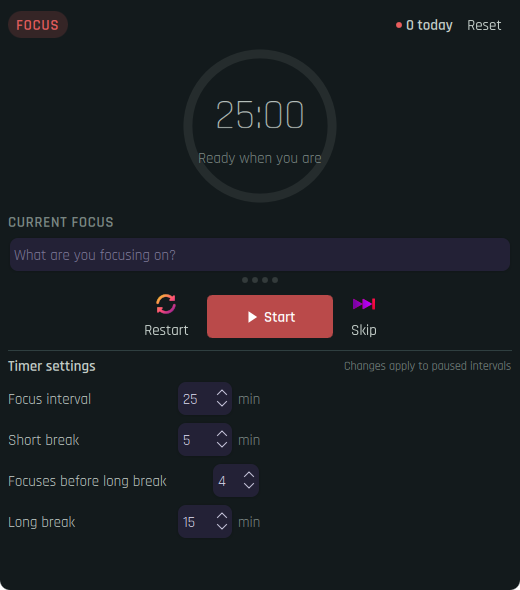

# Pomodoro Focus for KDE Plasma

A native Plasma 6 panel widget that keeps your current focus and live Pomodoro countdown one click away.

<p align="center">
  
</p>

## Quick install

Requires KDE Plasma 6, `curl`, and `kpackagetool6`.

```sh
curl -fsSL https://raw.githubusercontent.com/cromewar/kde-pomodoro/main/install.sh | bash
```

Then right-click your panel, choose **Enter Edit Mode** → **Add Widgets**, search for **Pomodoro Focus**, and drag it onto any panel. Run the same command again whenever you want to update the widget.

## Features

- Live countdown and circular progress indicator directly on horizontal or vertical panels
- Focus, short-break, and long-break phases
- Editable current-focus description in the popup, tooltip, and horizontal panel
- Configurable focus, short-break, and long-break durations
- Configurable number of focus sessions before a long break
- Start, pause, restart, and skip controls
- Daily Pomodoro count with automatic midnight reset and a manual reset action
- Persistent Plasma notifications with an action to start the next interval
- Timer deadline and cycle state preserved across Plasma shell restarts
- Native Plasma styling that follows your color scheme

## Manual install

Clone the repository and install the package:

```sh
git clone https://github.com/cromewar/kde-pomodoro.git
cd kde-pomodoro
kpackagetool6 --type Plasma/Applet --install .
```

To upgrade a manual installation:

```sh
kpackagetool6 --type Plasma/Applet --upgrade .
```

To uninstall:

```sh
kpackagetool6 --type Plasma/Applet --remove org.kde.plasma.pomodoro
```

## Development

Preview the installed widget in a standalone Plasma window:

```sh
plasmawindowed org.kde.plasma.pomodoro
```

The package targets Plasma 6 (`X-Plasma-API-Minimum-Version: 6.0`) and uses only QML and standard KDE Frameworks components.

## Inspiration

The focus-naming workflow takes inspiration from [Session](https://www.stayinsession.com/), while the minimal recurring timer flow takes inspiration from [Flow](https://www.flow.app/). This project is independent and includes no source code or assets from either application.

## License

[MIT](LICENSE)
