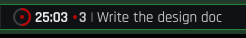
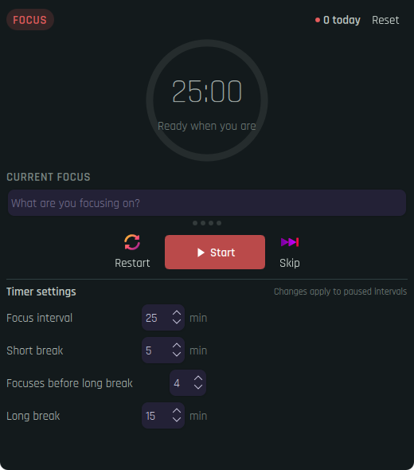

# Pomodoro Focus for KDE Plasma

A native Plasma 6 panel widget that keeps your current focus and live Pomodoro countdown one click away.

### Compact panel

<p align="center">
  
</p>

### Popup controls

<p align="center">
  
</p>

## Quick install

Requires KDE Plasma 6, `curl`, and `kpackagetool6`.

```sh
curl -fsSL https://raw.githubusercontent.com/cromewar/kde-pomodoro/main/install.sh | bash
```

Then right-click your panel, choose **Enter Edit Mode** → **Add Widgets**, search for **Pomodoro Focus**, and drag it onto any panel. Run the same command again whenever you want to update the widget.

The installer also copies the widget's notification events into `~/.local/share/knotifications6/`, which is what makes the end-of-interval notifications appear at all — see [Notification events](#notification-events-required).

## Features

- Live countdown and circular progress indicator directly on horizontal or vertical panels
- Focus, short-break, and long-break phases
- Estimated finish time for the running interval, shown in the popup and the tooltip in your local 12- or 24-hour format
- Editable current-focus description in the popup, tooltip, and horizontal panel
- Focus, short-break, and long-break durations set in the widget settings dialog
- Configurable number of focus sessions before a long break
- Built-in interval presets — Classic (25/5/15), Deep work (50/10/30), and Long haul (90/20/30) — switchable from the right-click menu or the settings dialog
- Start, pause, restart, and skip controls in the popup, mirrored in the right-click menu
- Optional auto-start of breaks and of focus intervals, toggled independently in the settings dialog
- Daily Pomodoro count with automatic midnight reset, plus a manual reset in the right-click menu
- Lifetime focus total alongside today's count in the tooltip
- Separate Plasma notifications for the end of a focus interval and the end of a break, each with its own sound and an action to start the next interval, all configurable in **System Settings → Notifications → Pomodoro Focus**
- Timer deadline and cycle state preserved across Plasma shell restarts
- Native Plasma styling that follows your color scheme

## Notification events (required)

> [!IMPORTANT]
> **The widget's notifications do not work until `org.kde.plasma.pomodoro.notifyrc` is installed into `~/.local/share/knotifications6/`.**
> Without that file, KNotification finds no event configuration and drops the notification silently: no popup, no sound, nothing in the notification history — the interval just ends.
>
> The `install.sh` one-liner above does this for you. **Every other installation route does not**, including `kpackagetool6 --install`, the KDE Store, and Plasma's "Get New Widgets" downloader, because a plasmoid package is installed into `~/.local/share/plasma/plasmoids/` and KNotifications never looks there.
>
> After installing the widget by any of those routes, run:
>
> ```sh
> mkdir -p ~/.local/share/knotifications6
> cp ~/.local/share/plasma/plasmoids/org.kde.plasma.pomodoro/notifications/org.kde.plasma.pomodoro.notifyrc \
>    ~/.local/share/knotifications6/
> ```
>
> (From a clone, copy `notifications/org.kde.plasma.pomodoro.notifyrc` instead.) Repeat this after any update that changes the file.

Once it is in place, **System Settings → Notifications → Application settings** lists **Pomodoro Focus** with two independently configurable events — *Focus interval finished* and *Break finished* — where you can change their sounds, popup behaviour, and urgency.

Version 2.0.0 moved these notifications off the stock **Timer** applet's `plasma_applet_timer` event, which the widget previously borrowed. If you had customised the Timer applet's notification sound, this widget no longer follows that customisation: configure **Pomodoro Focus** instead.

## Manual install

Clone the repository and install the package:

```sh
git clone https://github.com/cromewar/kde-pomodoro.git
cd kde-pomodoro
kpackagetool6 --type Plasma/Applet --install .
mkdir -p ~/.local/share/knotifications6
cp notifications/org.kde.plasma.pomodoro.notifyrc ~/.local/share/knotifications6/
```

To upgrade a manual installation:

```sh
kpackagetool6 --type Plasma/Applet --upgrade .
cp notifications/org.kde.plasma.pomodoro.notifyrc ~/.local/share/knotifications6/
```

To uninstall:

```sh
kpackagetool6 --type Plasma/Applet --remove org.kde.plasma.pomodoro
rm -f ~/.local/share/knotifications6/org.kde.plasma.pomodoro.notifyrc
```

## Development

Preview the installed widget in a standalone Plasma window:

```sh
plasmawindowed org.kde.plasma.pomodoro
```

The package targets Plasma 6 (`X-Plasma-API-Minimum-Version: 6.0`) and uses only QML and standard KDE Frameworks components.

## Inspiration

The focus-naming workflow takes inspiration from [Session](https://www.stayinsession.com/), while the minimal recurring timer flow takes inspiration from [Flow](https://www.flow.app/). This project is independent and includes no source code or assets from either application.

## License

[MIT](LICENSE)
