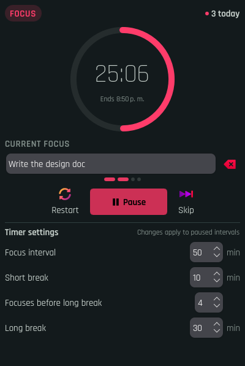
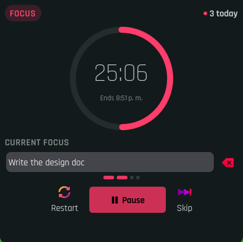

# Pomodoro Focus for KDE Plasma

A native Plasma 6 panel widget that keeps your current focus and live Pomodoro countdown one click away.

<p align="center">
  
</p>

<p align="center">
  <em>In the panel: progress ring, countdown, sessions completed today, and what you are working on.</em>
</p>

<table>
  <tr>
    <td align="center" width="50%">
      
      <br><strong>Full popup</strong> — durations right where you need them
    </td>
    <td align="center" width="50%">
      
      <br><strong>Compact popup</strong> — settings tucked into the config dialog
    </td>
  </tr>
</table>

Both layouts are one checkbox apart. The widget follows your Plasma color scheme, so the phase colors above will match whatever theme you run.

## Quick install

Requires KDE Plasma 6, `curl`, and `kpackagetool6`.

```sh
curl -fsSL https://raw.githubusercontent.com/cromewar/kde-pomodoro/main/install.sh | bash
```

Then right-click your panel, choose **Enter Edit Mode** → **Add Widgets**, search for **Pomodoro Focus**, and drag it onto any panel. Run the same command again whenever you want to update.

The installer also copies the widget's notification events into `~/.local/share/knotifications6/`, which is what makes the end-of-interval notifications appear at all — see [Notification events](#notification-events-required).

## Features

**The timer**

- Live countdown and circular progress indicator on horizontal or vertical panels
- Focus, short-break, and long-break phases, with a configurable number of focuses before each long break
- Estimated finish time for the running interval, in your local 12- or 24-hour format
- Start, pause, restart, and skip, from the popup or the right-click menu
- Optional auto-start of breaks and of focus intervals, toggled independently
- Built-in presets — Classic (25/5/15), Deep work (50/10/30), Long haul (90/20/30)

**Staying oriented**

- An editable *current focus* description, shown in the popup, the tooltip, and the panel itself
- Session pips showing how far you are through the cycle toward the next long break
- Daily count with automatic midnight reset, plus a manual reset in the right-click menu
- Lifetime focus total alongside today's count in the tooltip

**Fitting into Plasma**

- Phase colors derived from your color scheme rather than hardcoded, so light, dark, and high-contrast themes all work
- Separate notifications for the end of a focus interval and the end of a break, each with its own sound and an action to start the next interval, all configurable in **System Settings → Notifications**
- The timer deadline is wall-clock based, so a running interval survives a Plasma shell restart, a suspend, or a logout without drifting
- Pure QML and standard KDE Frameworks — no compiled plugin, no external dependencies

## Where each setting lives

Settings are placed by how often they change, so the popup stays quick to use.

| | Where |
|---|---|
| Current focus description | The popup |
| Start / pause / restart / skip | The popup, mirrored in the right-click menu |
| Interval durations, focuses before a long break | The config dialog — or the popup too, if **Repeat these settings inside the widget popup** is on (it is by default) |
| Auto-start breaks / focus | The config dialog |
| Interval presets | The right-click menu, and the config dialog |
| Reset today's count | The right-click menu |
| Notification sounds, popups, urgency | **System Settings → Notifications → Pomodoro Focus** |
| Global keyboard shortcut | The config dialog's **Shortcuts** page, which Plasma provides for every widget |

## Notification events (required)

> [!IMPORTANT]
> **The widget's notifications do not work until `org.kde.plasma.pomodoro.notifyrc` is installed into `~/.local/share/knotifications6/`.**
> Without that file, KNotification finds no event configuration and drops the notification entirely: no popup, no sound, nothing in the notification history — the interval just ends.
>
> The `install.sh` one-liner above does this for you. **Every other installation route does not**, including `kpackagetool6 --install`, the KDE Store, and Plasma's "Get New Widgets" downloader, because a plasmoid package is installed into `~/.local/share/plasma/plasmoids/` and KNotifications never looks there.
>
> After installing the widget by any of those routes, run:
>
> ```sh
> mkdir -p ~/.local/share/knotifications6
> cp ~/.local/share/plasma/plasmoids/org.kde.plasma.pomodoro/notifications/org.kde.plasma.pomodoro.notifyrc \
>    ~/.local/share/knotifications6/
> ```
>
> (From a clone, copy `notifications/org.kde.plasma.pomodoro.notifyrc` instead.) Repeat this after any update that changes the file.

Once it is in place, **System Settings → Notifications → Application settings** lists **Pomodoro Focus** with two independently configurable events — *Focus interval finished* and *Break finished* — where you can change their sounds, popup behaviour, and urgency.

Version 2.0.0 moved these notifications off the stock **Timer** applet's `plasma_applet_timer` event, which the widget previously borrowed. If you had customised the Timer applet's notification sound, this widget no longer follows that customisation: configure **Pomodoro Focus** instead.

## Manual install

```sh
git clone https://github.com/cromewar/kde-pomodoro.git
cd kde-pomodoro
kpackagetool6 --type Plasma/Applet --install .
mkdir -p ~/.local/share/knotifications6
cp notifications/org.kde.plasma.pomodoro.notifyrc ~/.local/share/knotifications6/
```

To upgrade a manual installation:

```sh
kpackagetool6 --type Plasma/Applet --upgrade .
cp notifications/org.kde.plasma.pomodoro.notifyrc ~/.local/share/knotifications6/
```

To uninstall:

```sh
kpackagetool6 --type Plasma/Applet --remove org.kde.plasma.pomodoro
rm -f ~/.local/share/knotifications6/org.kde.plasma.pomodoro.notifyrc
```

Plasma caches applet QML at shell start, so after an upgrade restart the shell to pick up the new version:

```sh
systemctl --user restart plasma-plasmashell.service
```

## Development

```sh
kpackagetool6 --type Plasma/Applet --upgrade .   # install your working copy
plasmawindowed org.kde.plasma.pomodoro           # preview the popup standalone
qmllint contents/ui/*.qml                        # lint
```

`plasmawindowed` shows only the full representation and has no form factor, so panel-specific behaviour has to be checked in a real panel. It reads its own config from `~/.config/plasmawindowedrc` under `[Applets][N][Configuration][General]`, which is handy for seeding a particular timer state.

Two lint caveats worth knowing: `qmllint` reports every `i18n()` call as unqualified access and cannot see `KConfigPropertyMap::writeConfig`, because the Plasma engine injects both at runtime. Both are expected noise.

The package targets Plasma 6 (`X-Plasma-API-Minimum-Version: 6.0`) and uses only QML and standard KDE Frameworks components.

## Scope

This is a panel widget, not a productivity suite. Some things are deliberately out of scope, so that it stays fast to open and easy to reason about:

- **No task management.** One free-text "current focus" field is the whole of intent capture — no lists, estimates, projects, or tags. If you need more, you need a task app, and this widget should name what you are doing in it rather than replace it.
- **No screen takeover.** No fullscreen break overlays, no forced windows. A persistent, high-urgency notification is the ceiling.
- **No system-wide state changes.** No toggling Do Not Disturb, no muting, no window management.
- **No blocking or monitoring.** No website blockers, no idle shaming, no streaks to break.
- **No accounts, sync, or telemetry.** History is a bounded rolling window in the widget's own config and nothing more.
- **No hardcoded colors.** Everything follows your Plasma color scheme.

## Inspiration

The focus-naming workflow takes inspiration from [Session](https://www.stayinsession.com/), while the minimal recurring timer flow takes inspiration from [Flow](https://www.flow.app/). This project is independent and includes no source code or assets from either application.

## License

[MIT](LICENSE)
